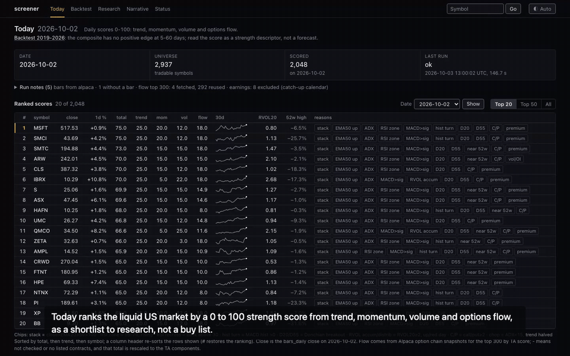
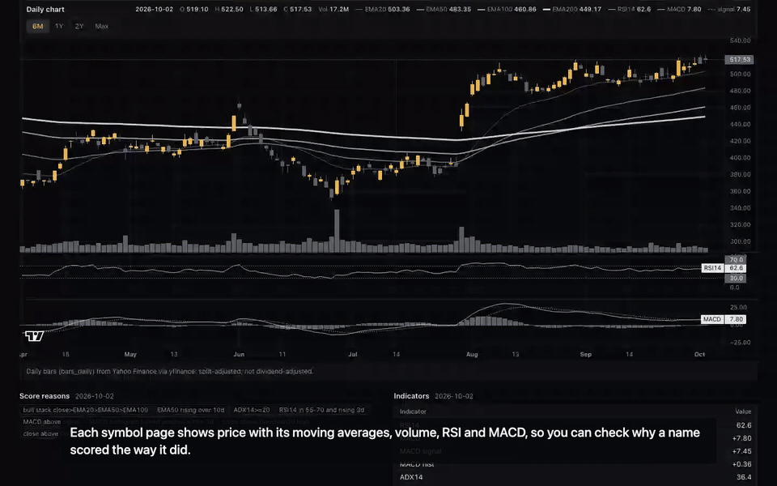
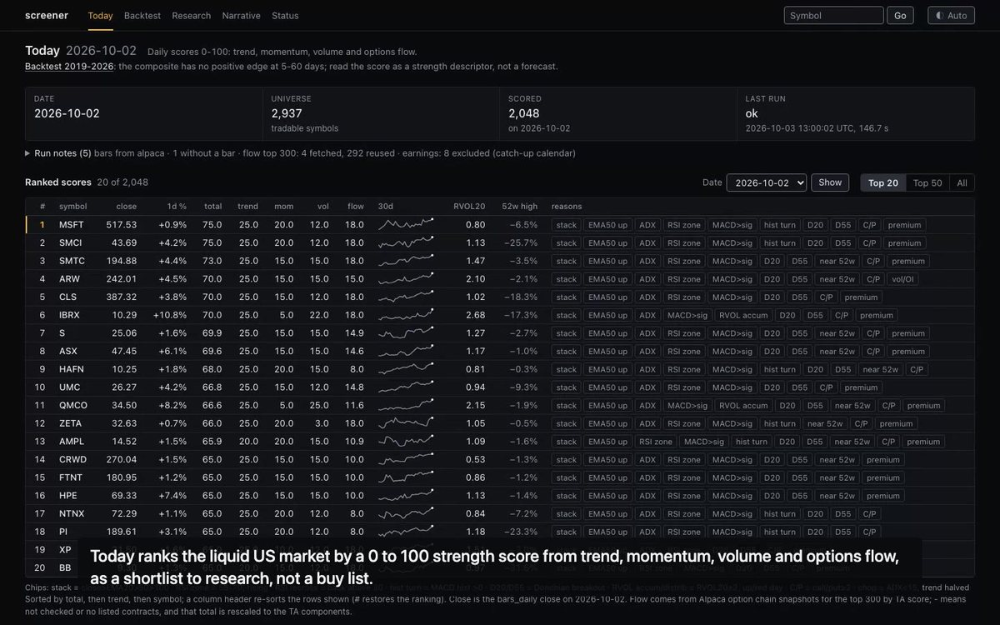
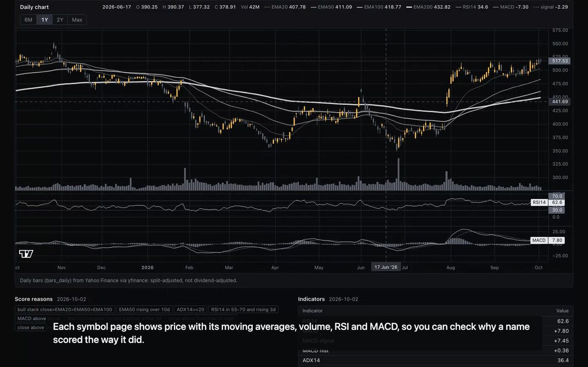
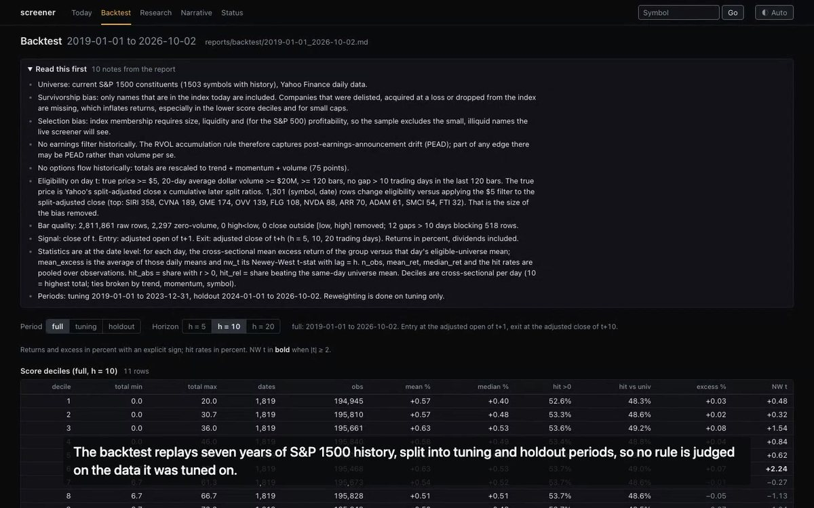
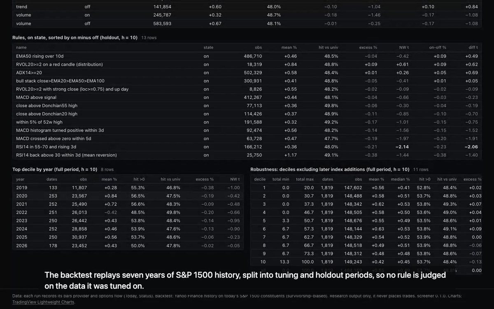
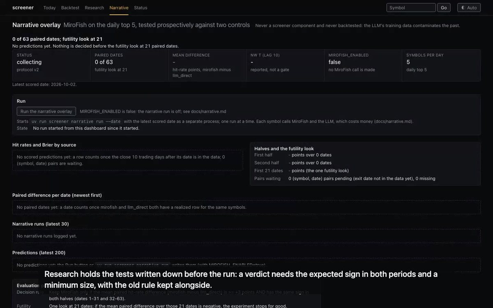
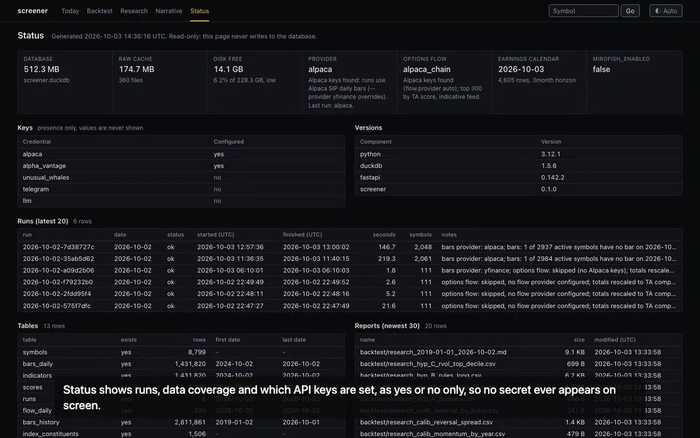

# stock-screener

A daily US equity screener with a local dashboard, a seven-year backtest, and a research page that holds the
scores to tests written down before the run. Python, one person, 2026.

This repository is the demo and the overview. The source is private (the project is being developed as a
product); a walkthrough of the code is available on request.

## What it does

Once per trading day, after the close, it scans about 2,900 tradable US symbols, computes technical indicators
and an options-flow signal, scores every symbol from 0 to 100, and writes a ranked report with the reasons behind
each score. The dashboard has six views:

- **Today**: the ranked shortlist. Every score explains itself with chips naming the rules that fired. It is a
  shortlist to research, not a buy list, and the page says so.
- **Symbol pages**: price with moving averages, volume, RSI and MACD, so you can check why a name scored the way
  it did. Any US ticker outside the universe is fetched on demand, once per day, and labelled as such.
- **Backtest**: seven years of S&P 1500 history, split into tuning and holdout periods, so no rule is judged on
  the data it was tuned on.
- **Research**: the hypotheses, written before the run. A verdict needs the expected sign in both periods and a
  minimum sample size, and the old rule is kept alongside the new one.
- **Narrative overlay**: an optional language-model layer on the daily top five. It stays off until switched on
  by hand, never calls a paid model or outside service on its own, and is never a score component.
- **Status**: runs, data coverage, and which API keys are set, as yes or no only. No secret ever appears on screen.

## What the backtest found

No positive edge for the composite score at 5 to 60 trading days on 2019 to 2026 S&P 1500 history, and two of
the component rules were negative. Even the textbook calibration effects (12-1 momentum, short-term reversal) did
not pass the pre-registered gate. The tool therefore says what it is: a research and candidate-generation tool,
not a trading system. It never places, routes or simulates an order, and a test fails on any broker client method
outside a short read-only list.

## How it is built

Python 3.12, DuckDB for storage, a Typer command line, a FastAPI dashboard with server-rendered pages,
indicators written by hand and checked against TA-Lib, market-data providers behind adapters (Alpaca, yfinance,
Alpha Vantage), a Telegram summary, a local launchd schedule and a GitHub Actions workflow for the cloud. More than
900 offline tests (no network, no real key ever reaches a test), ruff lint and format on every push. Secrets live
only in `.env` and never reach a log, report, page or message. Built solo in 2026, with Claude Code as pair
programmer and every change reviewed and tested.

## Stills from the demo

| | |
|---|---|
|  |  |
|  |  |
|  |  |

The full 60-second demo: [media/screener-demo.mp4](media/screener-demo.mp4).

## Contact

Arda Noyan Karasoglu, [LinkedIn](https://www.linkedin.com/in/ardanoyankarasoglu).
